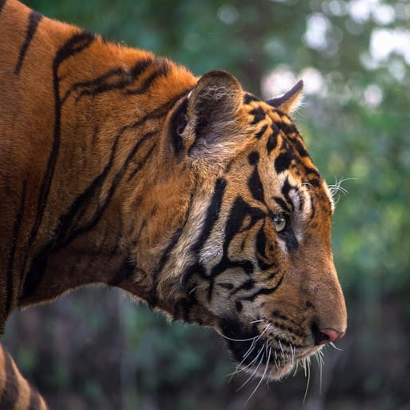

# Circle-packing

This is a common trope in graphics programming as almost everyone learning
graphics attempts this at some time. It's simple and fun and cool.

So when I saw this one on ["The Coding Train"][1] I had to do it. There's two
parts to this on the channel - [Part I][2] & [Part II][3]

## What is Circle-Packing?

A Circle-packing program will attempt to pack as many circles of varying sizes
across a canvas without any two circles overlapping.

Here's an example:
TODO: example

# Circle-packing on a photo

In this simulation we will take an image and random pack circles across
a canvas but picking up the color of the circle from the pixel on the image
which corresponds to the center of the circle.

Here's a public domain tiger image:

And the result of circle packing using the image as reference.

TODO: Add video

# Appendix

* Tiger Image Source(tiger.jpg): https://www.pexels.com/photo/close-up-of-tiger-247615/