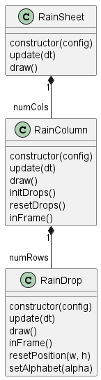

# Matrix Rain Simulation

This is a literate program to simulate the famous [Matrix Rain][1] simulation.
It is a straightforward implementation written in Love2d. The rain visualization
is implemented using classes which represent the objects displayed on the screen.

[1]: https://en.wikipedia.org/wiki/Matrix_digital_rain

## Demo

Here is a demo of the final program output. Note that it is in low resolution to
reduce the file size.


## Screenshot

A screenshot of the final program on windows shows how one frame looks like.


## Building and Running the Program

See the `Makefile` in the current directory to see how to build and run the
program.

# Design of the Program

* The Matrix Rain program tries to simulate each of the objects in the scene as
classes.
* Each individual character dropping down the scene is modelled as a
`RainDrop` class.
* Each column of falling `RainDrops` is modelled as a `RainColumn` class.
* Finally the whole rain is modelled as a `RainSheet`.
* The following class diagram shows the relationships of the three classes.
* The `main.lua` program instantiates the `RainSheet` and calls the `update` and
  `draw` functions of the object at appropriate times.
* The `RainSheet` in turn calls `update` and `draw` on each `RainColumn` which
  in turn does the same for each `RainDrop`.
* Various input parameters to the `RainSheet` decide the number of columns,
  number of drops per column and also the maximum speed of the rain.



In the subsequent sections we implement the classes first and then we use the
classes in the `main.lua` program.

# RainDrop Class

- The `RainDrop` class represents the smallest unit/atom of the program. It
represents one falling letter on the screen.
- Each `RainDrop` is constructed with a configuration, some initialization
  parameters.
- The `update(dt)` and `draw()` methods correspond to the lifecycle methods of
  love2d and are supposed to be called every frame. They update the state of the
  instance and draw the instance respectively.
- There are a couple of utility methods `resetPosition` and `setAlphabet`
  provided to help reuse the instance as another drop after the current one has
  gone past the screen.
- The `inFrame` method helps figure out if the `RainDrop` is beyond the screen
  dimenstions.

The program uses the [`middleclass`][2] library for implementing classes.

[2]: https://github.com/kikito/middleclass

```lua {code_file="raindrop.lua"}
local Class = require 'middleclass'
local utf8 = require("utf8")

@<hsvrgb@>

-- fonts for the raindrop
local NORMAL_FONT
local GLOW_FONT

local GREEN_HSV = {1/3, 1, 1}

local RainDrop = Class('RainDrop')

@<raindropconstructor@>

@<raindropupdate@>

@<raindropdraw@>

@<raindropinframe@>

@<raindropresetposition@>

@<raindropsetalphabet@>

return RainDrop
```

## HSV to RGB Utility

The colours used do draw the `RainDrop` are stored in HSV and are only converted
to RGB when drawing. This way the value part of the colour can be changed on
every update to give a flickering look to the letter and the scene as a whole.

The following utility method from the love2d.org wiki site helps convert from
HSV values to RGB values.

```lua {code_id="hsvrgb"}
--- copied from https://love2d.org/wiki/HSV_color
-- Converts HSV to RGB. (input and output range: 0 - 1)
local function HSV(h, s, v)
    if s <= 0 then return v,v,v end
    h = h*6
    local c = v*s
    local x = (1-math.abs((h%%2)-1))*c
    local m,r,g,b = (v-c), 0, 0, 0
    if h < 1 then
        r, g, b = c, x, 0
    elseif h < 2 then
        r, g, b = x, c, 0
    elseif h < 3 then
        r, g, b = 0, c, x
    elseif h < 4 then
        r, g, b = 0, x, c
    elseif h < 5 then
        r, g, b = x, 0, c
    else
        r, g, b = c, 0, x
    end
    return r+m, g+m, b+m
end
```

## RainDrop Constructor

* The `RainDrop` is constructed with some initialization parameters. These
  parameters specify:
    - A position (`config.x`, `config.y`)
    - The dimensions of the drop (`config.w`, `config.h`)
    - The speed of the drop (`config.vx`, `config.vy`). The `vx` is always 0 in
      the current program as the rain only drops down and does not move
      horizontally.
    - The optional `config.color` can set the colour of the text to the
      specified HSV value.
* The constructor generates a random alphabet from a few supported codepoint
  ranges in unicode and also loads the appropriate fonts.
* A love2d text object representing the alphabet to be drawn is created and
  stored to avoid creating it in every draw call.

```lua {code_id="raindropconstructor"}
function RainDrop:initialize(config)
    self.config = config
    self.x = config.x
    self.y = config.y
    self.w = config.w
    self.h = config.h
    self.vx = config.vx
    self.vy = config.vy
    self.color = config.color or GREEN_HSV
    self.glowColor = self.color

    local lang = math.random(1, 3)
    if lang == 1 then
        self.alphabet = utf8.char(utf8.codepoint('अ') + math.random(0, 50))
    elseif lang == 2 then
        self.alphabet = utf8.char(utf8.codepoint('a') + math.random(0, 25))
    elseif lang == 3 then
        self.alphabet = utf8.char(utf8.codepoint('ಅ') + math.random(0, 30))
    end

    if not NORMAL_FONT then
        NORMAL_FONT = {
            love.graphics.newFont('NotoSans_Condensed-Regular.ttf', math.min(self.w, self.h)),
            love.graphics.newFont('NotoSans_Condensed-Regular.ttf', math.min(self.w, self.h)),
            love.graphics.newFont('NotoSansKannada-Regular.ttf', math.min(self.w, self.h))
        }
        GLOW_FONT = {
            love.graphics.newFont('NotoSans_Condensed-Regular.ttf', 0.95 * math.min(self.w, self.h)),
            love.graphics.newFont('NotoSans_Condensed-Regular.ttf', 0.95 * math.min(self.w, self.h)),
            love.graphics.newFont('NotoSansKannada-Regular.ttf', 0.95 * math.min(self.w, self.h))
        }
    end

    -- create love2d text for the alphabet
    self.text = love.graphics.newText(NORMAL_FONT[lang], self.alphabet)
    self.glowText = love.graphics.newText(GLOW_FONT[lang], self.alphabet)

    self.timer = 0
end
```

## RainDrop Update

* The `update(dt)` method updates the position of the drop.
* In this method we also use inbuilt Simplex noise to change the Value part of
  the drawing colour thus giving a flickering look to the text.
* The `timer` used to get the time-based parameter for the noise lookup is also
  reset if it crosses a hard-coded threshold of 100 seconds.

```lua {code_id="raindropupdate"}
function RainDrop:update(dt)
    self.x = self.x + (self.vx * dt)
    self.y = self.y + (self.vy * dt)

    local timeSlot = self.timer %% 17
    local ySlot = self.y %% 50
    local xSlot = self.x %% 100
    self.color[3] = love.math.noise(ySlot, xSlot, timeSlot)
    self.glowColor[3] = love.math.noise(ySlot, xSlot, timeSlot)

    self.timer = self.timer + dt
    if self.timer > 100 then
        self.timer = 0
    end
end
```

## RainDrop Draw

* We simply use the colour, position and text of the drop to draw it.

```lua {code_id="raindropdraw"}
function RainDrop:draw()
    local color_rgb = {HSV(unpack(self.color))}
    color_rgb[4] = 1
    local glowColor_rgb = {HSV(unpack(self.glowColor))}
    glowColor_rgb[4] = 0.8

    love.graphics.setColor(color_rgb)
    love.graphics.draw(self.text, self.x + self.w/2 - self.text:getWidth()/2,
            self.y + self.h/2 - self.text:getHeight()/2)
    love.graphics.setColor(glowColor_rgb)
    love.graphics.draw(self.glowText,
            self.x + self.w/2 - self.glowText:getWidth()/2,
            self.y + self.h/2 - self.glowText:getHeight()/2)
end
```

## RainDrop In Frame?

* This method checks if the current postion of the drop is beyond the bounds of
the canvas.

```lua {code_id="raindropinframe"}
function RainDrop:inFrame(cw, ch)
    return self.x <= cw and self.y <= ch
end
```

## RainDrop Reset Position

* Updates the position of the drop back to its initial settings.

```lua {code_id="raindropresetposition"}
function RainDrop:resetPosition(x, y)
    self.x = self.config.x
    self.y = self.config.y
end
```

## RainDrop Set Alphabet

* Change the alphabet to the given alphabet.
* This method is not used at the moment.

```lua {code_id="raindropsetalphabet"}
function RainDrop:setAlphabet(alpha)
    self.alphabet = alpha
end
```

# RainColumn Class

* The `RainColumn` class contains a sequence or an array of `RainDrop`
  instances.
* In the simulation it represents one column of display in the matrix rain
  simulation.
* The `RainColumn` is initialized with some configuration parameters including
  its location, size, velocity, and number of rows/drops.
* The class has the standard lifecycle methods of `update(dt)` and `draw()`
  methods to be called at the appropriate time.
* Some utility methods like `initDrops`, `inFrame` and `resetDrops` provide the
  ability to reuse the same instance once the entire column is past the screen.
  This helps us reduce the number of objects created by simply resetting the
  column to its original position.

```lua {code_file="raincolumn.lua"}
local Class = require 'middleclass'
local RainDrop = require 'raindrop'

local RainColumn = Class('RainColumn')

@<raincolumnconstructor@>
@<raincolumninitdrops@>
@<raincolumnresetdrops@>
@<raincolumnupdate@>
@<raincolumndraw@>
@<raincolumninframe@>

return RainColumn
```

## RainColumn Constructor

* The constructor takes a `config` table which contains initialization
  parameters for the column of rain drops.
    - The location of the column on the x-axis is given by `config.x`.
    - The size of column is given by (`config.w`, `config.h`).
    - The vertical velocity of the column is given by `config.vy`. The
      horizontal velocity is 0.
    - The number of drops in the column are given by `config.numRows`.
* After initializing the state variables, the constructor calls the utility
  method `initDrops` to initialize the `RainDrop` instances.

```lua {code_id="raincolumnconstructor"}
function RainColumn:initialize(config)
    self.x = config.x
    self.w = config.w
    self.h = config.h
    self.vy = config.vy
    self.numRows = config.numRows
    self.rowHeight = self.h/self.numRows

    self:initDrops()
end
```

## RainColumn Initialize Drops

* This method creates an array of `RainDrop` instances of the same size.
* The size of each `RainDrop` is equal to (`self.w`, `self.rowHeight`). Where
  `rowHeight` is `self.h/self.numRows`.
* The drops are placed one after the other in a vertical line and each of them
  is given the velocity (`0`, `self.vy`) thus making sure they all move at the
  same speed in tandem.
* The bottom-most drop is given a colour white.

```lua {code_id="raincolumninitdrops"}
function RainColumn:initDrops()
    self.numDrops = math.random(1, 2 * self.numRows)
    local colHeight = self.numDrops * self.rowHeight

    self.drops = {}
    for i = 1, self.numDrops do
        local dropConfig = {
                x = self.x,
                y = colHeight/2 - ((i - 1) * self.rowHeight),
                w = self.w,
                h = self.rowHeight,
                vx = 0,
                vy = self.vy
            }
        if i == 1 then
            dropConfig.color = {0, 0, 1}
        end
        table.insert(self.drops,
            RainDrop(dropConfig))
    end
end
```

## RainColumn Reset Drops

* This method iterates over all the drops in the array `self.drops` and resets
  their position by calling `drop:resetPosition`.

```lua {code_id="raincolumnresetdrops"}
function RainColumn:resetDrops()
    for _, drop in ipairs(self.drops) do
        drop:resetPosition()
    end
end
```

## RainColumn In Frame?

* This method checks if a sentinel drop in the column is past the frame by
  calling `inFrame` method on the drop.
* Currently the sentinel is one-third of the way down the column.

```lua {code_id="raincolumninframe"}
function RainColumn:inFrame()
    local outIndex = math.floor(self.numDrops/3)
    if outIndex < 1 then
        outIndex = 1
    end
    return self.drops[outIndex]:inFrame(love.graphics.getDimensions())
end
```

## RainColumn Update

* The `update(dt)` method first checks if the column is `inFrame`. If it is not
  in frame then it resets the drops, thereby resetting the column and reusing it
  for another run through the canvas.
* After the check the method iterates over each drop and calls `update(dt)` on
  each of them individually.

```lua {code_id="raincolumnupdate"}
function RainColumn:update(dt)
    if not self:inFrame() then
        self:resetDrops()
    end
    for i, drop in ipairs(self.drops) do
        drop:update(dt)
    end
end
```

## RainColumn Draw

* This method iterates over each drop and calls `draw()` for each of them.

```lua {code_id="raincolumndraw"}
function RainColumn:draw()
    for i, drop in ipairs(self.drops) do
        drop:draw()
    end
end
```


# RainSheet Class

* The `RainSheet` class as we discussed in the design represents the overall
  simulaton.
* The `RainSheet` contains an array of `RainColumn` instances moving at
  different speeds. This is what creates the illusion of matrix rain.
* Since the bulk of update and drawing takes place in the sub-ordinate classes
  `RainColumn` and `RainDrop`, this class is fairly simple. The bulk of the
  logic of the class is in setting up the initial parameters and starting up the
  simulation.
* The constructor sets up the simulation parametrs and creates an array of
  columns to fit the width of the canvas.

```lua {code_file="rainsheet.lua"}
local Class = require 'middleclass'
local RainColumn = require 'raincolumn'

local RainSheet = Class('RainSheet')

@<rainsheetconstructor@>
@<rainsheetupdate@>
@<rainsheetdraw@>

return RainSheet
```

## RainSheet Constructor

* The `RainSheet` constructor accepts a `config` table with its initialization
  parameters. This helps the class setup the simulation.
    - The number of columns is given by `config.numCols`.
    - The maximum number of rows possible in a rain column is given by
      `config.numRows`.
    - The maximum possible vertical velocity of a rain column is given by
      `config.maxVy`.
    - The size of the canvas is given by (`config.cw`, `config.ch`).
* Once all the state is initialized, the array of columns are created with their
  postion one after the other on the x-axis. Each column is given a random
  vertical speed.

```lua {code_id="rainsheetconstructor"}
function RainSheet:initialize(config)
    self.numCols = config.numCols
    self.numRows = config.numRows
    self.maxVy = config.maxVy
    self.cw = config.cw
    self.ch = config.ch

    self.colWidth = self.cw/self.numCols

    self.columns = {}
    for i = 1, self.numCols do
        local column = RainColumn({
            x = (i - 1) * self.colWidth,
            w = self.colWidth,
            h = self.ch,
            vy = math.random(self.maxVy/8, self.maxVy),
            numRows = self.numRows
        })
        table.insert(self.columns, column)
    end
end
```

## RainSheet Update

* This method simply iterates over each `RainColumn` and calls the `update(dt)`
  method on each instance.

```lua {code_id="rainsheetupdate"}
function RainSheet:update(dt)
    for _, column in ipairs(self.columns) do
        column:update(dt)
    end
end
```

## RainSheet Draw

* This method simply iterates over each `RainColumn` and calls the `draw()`
  method on each instance.

```lua {code_id="rainsheetdraw"}
function RainSheet:draw()
    for _, column in ipairs(self.columns) do
        column:draw()
    end
end
```

# Matrix Rain Program

* The main program in a love2d game is the `main.lua` file.
* One must define love2d lifecycle functions to implement the simulation.
* In the `love.load()` function we initialize the `RainSheet` with some
  configuration.
* In `love.update(dt)` we update the `RainSheet` instance stored in `sheet` and
  in `love.draw` we draw the `sheet`.
* There are a couple of shortcuts implemented:
    - `ESC` to quit the program
    - `Ctrl+f` to toggle the FPS of the simulation on the bottom right. By
       default the FPS display is turned off.

## Module Imports

* The only import needed is the `RainSheet` class in the **rainsheet.lua** file.

```lua {code_id="requiredeps"}
local RainSheet = require 'rainsheet'
```

## File Globals

* There are three sets of file global variables:
    - (`cw`, `ch`) store the size of the canvas. They are initialized in
      `love.load()`.
    - `fpsOn` is a boolean which indicates if the FPS of the simulation is to be
      shown.
    - `sheet` represents the instance of the `RainSheet` class created in the
      `love.load()` function.

```lua {code_id="fileglobals"}
local cw, ch
local fpsOn
local sheet
```

## Initialization

* The bulk of the code in this file is in the `love.load()` function where we
  setup the initialization parameters for the simulation.
* Based on a fixed number of rows and the given canvas size (as decided in the
  `conf.lua`) we set up the number of columns and a maximum rain speed.
* We then create a single instance of the `RainSheet` class with these
  parameters and store it in the `sheet` file-global variable.

```lua {code_id="loveload"}
function love.load()
    cw, ch = love.graphics.getDimensions()

    fpsOn = false

    local numRows = 40
    local numCols = cw / (ch/numRows)
    local maxRainSpeed = (ch/numRows) * 20

    -- create a font and set it as the active font
    -- with the default face, but size is equal to cw/numCols
    local font = love.graphics.newFont(cw/numCols)
    love.graphics.setFont(font)

    sheet = RainSheet({
        numRows = numRows,
        numCols = numCols,
        maxVy = maxRainSpeed,
        cw = cw,
        ch = ch
    })
end

```

## Update the Simulation

* This function calls `sheet:update(dt)`.

```lua {code_id="loveupdate"}
function love.update(dt)
    sheet:update(dt)
end

```

## Draw the Simulation

* This method calls `sheet:draw()`.
* It also checks the `fpsOn` variable to see if the FPS is to be displayed on
  the screen.

```lua {code_id="lovedraw"}
function love.draw()
    sheet:draw()

    -- draw fps
    if fpsOn then
        love.graphics.setColor(1, 1, 1, 1)
        love.graphics.print("FPS: "..tostring(love.timer.getFPS()), cw - 100, ch - 25)
    end
end

```

## Handle Keyboard Events

* The `love.keypressed(key)` lifecycle function is implemented to provide two
  shortcuts.
* If the user presses `ESC` key then the application quits.
* If the user presses `Ctrl+f` then the FPS display is toggled.

```lua {code_id="lovekeypressed"}
-- escape to exit
function love.keypressed(key)
    if key == "escape" then
        love.event.quit()
    end

    -- check for modifiers
	CTRL_KEY = ""
	SHIFT_KEY = ""
	ALT_KEY = ""
	if love.keyboard.isDown("lctrl") or love.keyboard.isDown("rctrl") then
		CTRL_KEY = "CTRL"
	end

	if love.keyboard.isDown("lshift") or love.keyboard.isDown("rshift") then
		SHIFT_KEY = "SHIFT"
	end

	if love.keyboard.isDown("lalt") or love.keyboard.isDown("ralt") then
		ALT_KEY = "ALT"
	end

    if CTRL_KEY and key == "f" then
        fpsOn = not fpsOn
    end
end
```


```lua {code_file="main.lua"}
--- main.lua: Matrix Rain Simulation in LÖVE
-- date: 16/05/2024
-- author: Abhishek Mishra

@<requiredeps@>

@<fileglobals@>

@<loveload@>

@<loveupdate@>

@<lovedraw@>

@<lovekeypressed@>
```

# Simulation Configuration

* In the `conf.lua` file we define some initialization parameters for the love2d
  simulation like size of the canvas, title of the window and we turn off some
  unused modules to make the simulation faster.

```lua { code_file="conf.lua" }
--- conf.lua: Config for the love2d game.
--
-- date: 4/3/2024
-- author: Abhishek Mishra

-- canvas size
local canvasWidth = 1024
local canvasHeight = 768

function love.conf(t)
    -- set the window title
    t.window.title = "Matrix Rain"

    -- set the window size
    t.window.width = canvasWidth
    t.window.height = canvasHeight

    -- disable unused modules for performance
    t.modules.joystick = false
    t.modules.physics = false
    t.modules.touch = false

    -- enable console
    -- TODO: turning on console crashes Love2D on Windows,
    -- so it's disabled for now
    -- t.console = true
end

```
