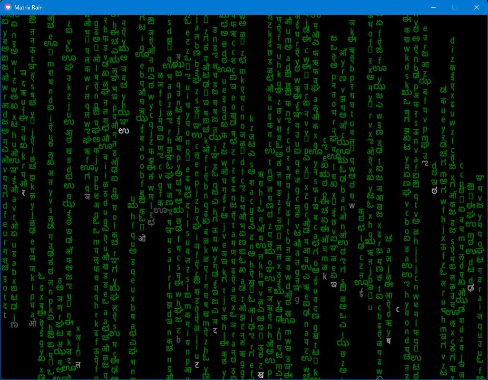

# Matrix Rain Simulation

## Demo

Here is a demo of the program output. Note that it is in low resolution to
reduce the file size.


## Screenshot



## Class Diagram


## Building and Running the Program

See the `Makefile` in the current directory to see how to build and run the
program.

# The RainDrop Class

```lua {code_file="raindrop.lua"}
local Class = require 'middleclass'
local utf8 = require("utf8")

@<hsvrgb@>

-- fonts for the raindrop
local NORMAL_FONT
local GLOW_FONT

local GREEN_HSV = {1/3, 1, 1}

local RainDrop = Class('RainDrop')

@<raindropconstructor@>

@<raindropupdate@>

@<raindropdraw@>

@<raindropinframe@>

@<raindropresetposition@>

@<raindropsetalphabet@>

return RainDrop
```

## HSV to RGB Utility

```lua {code_id="hsvrgb"}
--- copied from https://love2d.org/wiki/HSV_color
-- Converts HSV to RGB. (input and output range: 0 - 1)
local function HSV(h, s, v)
    if s <= 0 then return v,v,v end
    h = h*6
    local c = v*s
    local x = (1-math.abs((h%%2)-1))*c
    local m,r,g,b = (v-c), 0, 0, 0
    if h < 1 then
        r, g, b = c, x, 0
    elseif h < 2 then
        r, g, b = x, c, 0
    elseif h < 3 then
        r, g, b = 0, c, x
    elseif h < 4 then
        r, g, b = 0, x, c
    elseif h < 5 then
        r, g, b = x, 0, c
    else
        r, g, b = c, 0, x
    end
    return r+m, g+m, b+m
end
```

## RainDrop Constructor

```lua {code_id="raindropconstructor"}
function RainDrop:initialize(config)
    self.config = config
    self.x = config.x
    self.y = config.y
    self.w = config.w
    self.h = config.h
    self.vx = config.vx
    self.vy = config.vy
    self.color = config.color or GREEN_HSV
    self.glowColor = self.color

    local lang = math.random(1, 3)
    if lang == 1 then
        self.alphabet = utf8.char(utf8.codepoint('अ') + math.random(0, 50))
    elseif lang == 2 then
        self.alphabet = utf8.char(utf8.codepoint('a') + math.random(0, 25))
    elseif lang == 3 then
        self.alphabet = utf8.char(utf8.codepoint('ಅ') + math.random(0, 30))
    end

    if not NORMAL_FONT then
        NORMAL_FONT = {
            love.graphics.newFont('NotoSans_Condensed-Regular.ttf', math.min(self.w, self.h)),
            love.graphics.newFont('NotoSans_Condensed-Regular.ttf', math.min(self.w, self.h)),
            love.graphics.newFont('NotoSansKannada-Regular.ttf', math.min(self.w, self.h))
        }
        GLOW_FONT = {
            love.graphics.newFont('NotoSans_Condensed-Regular.ttf', 0.95 * math.min(self.w, self.h)),
            love.graphics.newFont('NotoSans_Condensed-Regular.ttf', 0.95 * math.min(self.w, self.h)),
            love.graphics.newFont('NotoSansKannada-Regular.ttf', 0.95 * math.min(self.w, self.h))
        }
    end

    -- create love2d text for the alphabet
    self.text = love.graphics.newText(NORMAL_FONT[lang], self.alphabet)
    self.glowText = love.graphics.newText(GLOW_FONT[lang], self.alphabet)

    self.timer = 0
end
```

## RainDrop Update

```lua {code_id="raindropupdate"}
function RainDrop:update(dt)
    self.x = self.x + (self.vx * dt)
    self.y = self.y + (self.vy * dt)

    local timeSlot = self.timer %% 17
    local ySlot = self.y %% 50
    local xSlot = self.x %% 100
    self.color[3] = love.math.noise(ySlot, xSlot, timeSlot)
    self.glowColor[3] = love.math.noise(ySlot, xSlot, timeSlot)

    self.timer = self.timer + dt
    if self.timer > 100 then
        self.timer = 0
    end
end
```

## RainDrop Draw

```lua {code_id="raindropdraw"}
function RainDrop:draw()
    local color_rgb = {HSV(unpack(self.color))}
    color_rgb[4] = 1
    local glowColor_rgb = {HSV(unpack(self.glowColor))}
    glowColor_rgb[4] = 0.8

    love.graphics.setColor(color_rgb)
    love.graphics.draw(self.text, self.x + self.w/2 - self.text:getWidth()/2, self.y + self.h/2 - self.text:getHeight()/2)
    love.graphics.setColor(glowColor_rgb)
    love.graphics.draw(self.glowText, self.x + self.w/2 - self.glowText:getWidth()/2, self.y + self.h/2 - self.glowText:getHeight()/2)
end
```

## RainDrop In Frame?

```lua {code_id="raindropinframe"}
function RainDrop:inFrame(cw, ch)
    return self.x <= cw and self.y <= ch
end
```

## RainDrop Reset Position

```lua {code_id="raindropresetposition"}
function RainDrop:resetPosition(x, y)
    self.x = self.config.x
    self.y = self.config.y
end
```

## RainDrop Set Alphabet

```lua {code_id="raindropsetalphabet"}
function RainDrop:setAlphabet(alpha)
    self.alphabet = alpha
end
```

# RainColumn Class

```lua {code_file="raincolumn.lua"}
local Class = require 'middleclass'
local RainDrop = require 'raindrop'

local RainColumn = Class('RainColumn')

@<raincolumnconstructor@>
@<raincolumninitdrops@>
@<raincolumnresetdrops@>
@<raincolumnupdate@>
@<raincolumndraw@>
@<raincolumninframe@>

return RainColumn
```

## RainColumn Constructor

```lua {code_id="raincolumnconstructor"}
function RainColumn:initialize(config)
    self.x = config.x
    self.w = config.w
    self.h = config.h
    self.vy = config.vy
    self.numRows = config.numRows
    self.rowHeight = self.h/self.numRows

    self:initDrops()
end
```

## RainColumn Initialize Drops

```lua {code_id="raincolumninitdrops"}
function RainColumn:initDrops()
    self.numDrops = math.random(1, 2 * self.numRows)
    local colHeight = self.numDrops * self.rowHeight

    self.drops = {}
    for i = 1, self.numDrops do
        local dropConfig = {
                x = self.x,
                y = colHeight/2 - ((i - 1) * self.rowHeight),
                w = self.w,
                h = self.rowHeight,
                vx = 0,
                vy = self.vy
            }
        if i == 1 then
            dropConfig.color = {0, 0, 1}
        end
        table.insert(self.drops,
            RainDrop(dropConfig))
    end
end
```

## RainColumn Reset Drops

```lua {code_id="raincolumnresetdrops"}
function RainColumn:resetDrops()
    for _, drop in ipairs(self.drops) do
        drop:resetPosition()
    end
end
```

## RainColumn In Frame?

```lua {code_id="raincolumninframe"}
function RainColumn:inFrame()
    local outIndex = math.floor(self.numDrops/3)
    if outIndex < 1 then
        outIndex = 1
    end
    return self.drops[outIndex]:inFrame(love.graphics.getDimensions())
end
```

## RainColumn Update

```lua {code_id="raincolumnupdate"}
function RainColumn:update(dt)
    if not self:inFrame() then
        self:resetDrops()
    end
    for i, drop in ipairs(self.drops) do
        drop:update(dt)
    end
end
```

## RainColumn Draw

```lua {code_id="raincolumndraw"}
function RainColumn:draw()
    for i, drop in ipairs(self.drops) do
        drop:draw()
    end
end
```


# RainSheet Class

```lua {code_file="rainsheet.lua"}
local Class = require 'middleclass'
local RainColumn = require 'raincolumn'

local RainSheet = Class('RainSheet')

@<rainsheetconstructor@>
@<rainsheetupdate@>
@<rainsheetdraw@>

return RainSheet
```

## RainSheet Constructor

```lua {code_id="rainsheetconstructor"}
function RainSheet:initialize(config)
    self.numCols = config.numCols
    self.numRows = config.numRows
    self.maxVy = config.maxVy
    self.cw = config.cw
    self.ch = config.ch

    self.colWidth = self.cw/self.numCols

    self.columns = {}
    for i = 1, self.numCols do
        local column = RainColumn({
            x = (i - 1) * self.colWidth,
            w = self.colWidth,
            h = self.ch,
            vy = math.random(self.maxVy/8, self.maxVy),
            numRows = self.numRows
        })
        table.insert(self.columns, column)
    end
end
```

## RainSheet Update

```lua {code_id="rainsheetupdate"}
function RainSheet:update(dt)
    for _, column in ipairs(self.columns) do
        column:update(dt)
    end
end
```

## RainSheet Draw

```lua {code_id="rainsheetdraw"}
function RainSheet:draw()
    for _, column in ipairs(self.columns) do
        column:draw()
    end
end
```
# Matrix Rain Program

## Module Imports

The program uses the [`middleclass`][1] library for implementing classes.

```lua {code_id="requiredeps"}
local RainSheet = require 'rainsheet'
```

## File Globals

```lua {code_id="fileglobals"}
local cw, ch
local fpsOn
local sheet
```

## Initialization

```lua {code_id="loveload"}
function love.load()
    cw, ch = love.graphics.getDimensions()

    fpsOn = false

    local numRows = 40
    local numCols = cw / (ch/numRows)
    local maxRainSpeed = (ch/numRows) * 20

    -- create a font and set it as the active font
    -- with the default face, but size is equal to cw/numCols
    local font = love.graphics.newFont(cw/numCols)
    love.graphics.setFont(font)

    sheet = RainSheet({
        numRows = numRows,
        numCols = numCols,
        maxVy = maxRainSpeed,
        cw = cw,
        ch = ch
    })
end

```

## Update the Simulation

```lua {code_id="loveupdate"}
function love.update(dt)
    sheet:update(dt)
end

```

## Draw the Simulation

```lua {code_id="lovedraw"}
function love.draw()
    sheet:draw()

    -- draw fps
    if fpsOn then
        love.graphics.setColor(1, 1, 1, 1)
        love.graphics.print("FPS: "..tostring(love.timer.getFPS()), cw - 100, ch - 25)
    end
end

```

## Handle Keyboard Events

```lua {code_id="lovekeypressed"}
-- escape to exit
function love.keypressed(key)
    if key == "escape" then
        love.event.quit()
    end

    -- check for modifiers
	CTRL_KEY = ""
	SHIFT_KEY = ""
	ALT_KEY = ""
	if love.keyboard.isDown("lctrl") or love.keyboard.isDown("rctrl") then
		CTRL_KEY = "CTRL"
	end

	if love.keyboard.isDown("lshift") or love.keyboard.isDown("rshift") then
		SHIFT_KEY = "SHIFT"
	end

	if love.keyboard.isDown("lalt") or love.keyboard.isDown("ralt") then
		ALT_KEY = "ALT"
	end

    if CTRL_KEY and key == "f" then
        fpsOn = not fpsOn
    end
end
```


```lua {code_file="main.lua"}
--- main.lua: Matrix Rain Simulation in LÖVE
-- date: 16/05/2024
-- author: Abhishek Mishra

@<requiredeps@>

@<fileglobals@>

@<loveload@>

@<loveupdate@>

@<lovedraw@>

@<lovekeypressed@>
```

# `conf.lua`

```lua { code_file="conf.lua" }
--- conf.lua: Config for the love2d game.
--
-- date: 4/3/2024
-- author: Abhishek Mishra

-- canvas size
local canvasWidth = 1024
local canvasHeight = 768

function love.conf(t)
    -- set the window title
    t.window.title = "Matrix Rain"

    -- set the window size
    t.window.width = canvasWidth
    t.window.height = canvasHeight

    -- disable unused modules for performance
    t.modules.joystick = false
    t.modules.physics = false
    t.modules.touch = false

    -- enable console
    -- TODO: turning on console crashes Love2D on Windows,
    -- so it's disabled for now
    -- t.console = true
end

```
