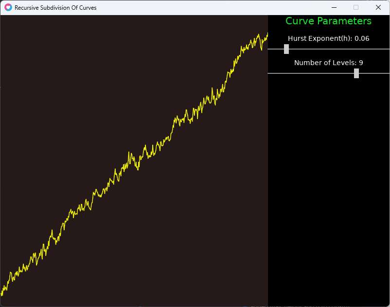

|Version     |Date      |Comments                       |
|------------|----------|-------------------------------|
|0.1         |25/11/2024|Initial version                |

# Recursive Subdivision Of Curves

This is a literate program (written in litpd [^litpd]) that demonstrates creating
fractal paths/curves starting with a simple curve with a few line segments. The
algorithm is from the classic paper on the topic of such methods [^fournier].
The paper discusses the use of recursive subdivision methods to create fractal
curves and surfaces. This method and its variations have been frequently used
as they produce decent results and the 1-D version that we use here has linear
complexity.



This article is divided into two sections:

1. *Algorithm*: We discuss the recursive subdivision algoritm and its properties
   in this section.
2. *Program*: We develop a love2d simulation to demonstrate the use of this
   algorithm in various scenarios and with varying parameters.

Here is a youtube video which shows the simulation in action:

<iframe width="630" height="473"
src="https://www.youtube.com/embed/NocRNKwlvCw">
</iframe>

[^litpd]: <https://neolateral.in/litpd-literate-programming-for-pandoc-markdown>
[^fournier]: <https://doi.org/10.1145/358523.358553> "Alain Fournier, Don
    Fussell, and Loren Carpenter. 1982. Computer rendering of stochastic
    models. Commun. ACM 25, 6 (June 1982), 371–384."

# The Algorithm in 1-D

The paper mentioned in the introduction [^fournier] describes the algorithm we
are about to discuss as "... a recursive algorithm for generating approximations
to the sample paths of one dimensional fBm" (fBm stands for _fractional
Brownian motion_). Thus the algorithm generates in every run a sample Brownian
motion path between the input end-points.

Since this algorithm is recursive in
nature it can be repeated to any level of detail. The detail in the curve
increases with the recursive depth of the program. This recursive depth should
be used to produce a curve that retains sufficient detail at the highest zoom
level used in the graphical application.

Now, let's jump into the algorithm. In the original paper the algorithm is
written in Pascal, however here I present it informally as we will later develop
the program in lua.

- **Step 1: End-points of the Curve:** First we must established the start and
    end-point of the curve. These will serve as the starting input to the
    recursive subdivision. These points on 1-d are simple _real_ values which
    can be given as user input or assigned to random values.

- **Step 2: Establish the number of points:** The paper provides states that for
    detail level `N`, the number of points in the curve should be `2^N`. The
    maxlevel `N` can be a user input.

- **Step 3: Recursive Subdivision:** In the third step we take a segment and
    find its midpoint. Then we perturb the midpoint by a random amount. This
    gives us two new segments. We run the process till the segments are of zero
    lengths and cannot be subdivided. Each recursive step doubles the number
    of segments to be processed in the next round. The entire process is started
    with the first and last points decided in the _Step 1_.

The amound of perturbation at each level of recursion decreases as we subdivide
smaller and smaller segments. The amount of randomness added is the **Hurst
Exponent** - which is related to the shape of the fBm. The value of the Hurst
Exponent decides the roughness/smoothness of the generated curve.

## Building and Running the Program

See the `Makefile` in the current directory to see how to build and run the
program.

# The fBm Curve

The `fbmcurve.lua` file defines the `FBMCurve` class. It represents a single
curve defined using recursive subdivision. The class is defined using the
`middleclass` library.

```lua {code_id="fbmdeclaration"}
local Class = require "middleclass"

local FBMCurve = Class("FBMCurve")
```

## Constructor

* The class constructor accepts four optional arguments `seed`, `num_levels`,
  `max_height`, and `h`.
* The `seed` argument is an input to the random number generator. The random
  number generator is used to create the perturbation in the midpoint when
  subdividing a line segment. The default value of `seed` is `1`.
* The `num_levels` argument controls how many points will be generated in the
  curve. It represents the amount of detail required in the curve. The higher
  the value, the greater the number of points in the curve. The default value
  for `num_levels` is `9`.
* The `max_height` is the maximum value of the curve generated. It is used to
  generate the first and last points of the curve. The x-values of each point
  in the curve is the index in the sequence of points.
* `h` is a parameter which controls roughness/smoothness of the generated curve.
  It's default is `0.01`.
* The constructor uses the inputs to initialize some state for the curve.
* The number of points `num_points` in the curve is first set equal to
  `2^num_levels + 1`.
* A new table `points` is created to store the points of the curve.
* The first and last points of the curve are created using the random number
  generator.
* A default initial value is assinged to all the other points of the curve.
* The `h` value refers to the `Hurst Exponent` and is used to calculate the
  ratio of dampening of the perturbation at each recursive depth. The dampening
  increases as we descend into sub-dividing smaller and smaller line segments.
  The value of `h` affects the roughness/smoothness of the generated curve.
* The `ratio` of dampening is defined as `2^-h`.

```lua {code_id="fbmconstructor"}
--- Create a new FBMCurve object
-- @param seed (number) The seed for the random number generator (default 1)
-- @param num_levels (number) The number of levels of the curve (default 9)
-- @param max_height (number) The max value of y-axis (default window height)
-- @prama h (number) Hurst Expoonent (default 0.01)
function FBMCurve:initialize(seed, num_levels, max_height, h)
    self.seed = seed or 1
    self.num_levels = num_levels or 9
    self.max_height = max_height or love.graphics.getHeight()
    self.h = 0.01

    self:generate()
end
```

## Gaussian Random Number Generator

* The `gauss` function is a utility function to generate random numbers
  using the inbuilt pseudo-random generator with a mean of `0` and a standard
  deviation of `1`.
* The seed of the random generator is based on the input index and the seed
  provided by user input. This allows us to create random number sequences
  which can be replicated if the same input is provided again.
* The function is used in the subdivision process.

```lua {code_id="fbmgauss"}
-- Generate a Gaussian (normal) distributed random number
function FBMCurve:gauss(index)
    -- Seed the RNG uniquely for deterministic results
    local combined_seed = self.seed + index
    math.randomseed(combined_seed)

    -- Generate two uniform random numbers (0, 1)
    local u1 = math.random()
    local u2 = math.random()

    -- Box-Muller transform
    local z0 = math.sqrt(-2.0 * math.log(u1)) * math.cos(2.0 * math.pi * u2)

    -- Return a Gaussian random number with mean 0 and standard deviation 1
    return z0 
end
```

## Subdivision Implemenation

* In the subdivision implementation we define two methods viz. `generate` and
  `subdivide`.
* The `generate` method sets up the parameters for the subdivision using the
  user provided input. The length of the curve is decided, the array of points
  are created to match the length, and the first and last points are assigned
  random y-values based on the maximum y-value of the display. The other values
  in the array are given initial values which are later changed by the
  `subdivide` method.
* Lastly, the `generate` method calls the `subdivide` method with the first and
  last counts of the points array, and a measure of standard division which is
  based on the input *Hurst Expoonent*.
* The `subdivide` method is a recursive function to create a new midpoint
  for the given range, until we are down to a range with width `1`.
* Each midpoint is the mean of the left and right values of the range added to
  a random value generated using the `gauss` function defined earlier multiplied
  with the given standard deviation. (Note the standard deviation of the value
  returned from `gauss` is 1). The scaling of the random adjustment reduces with
  the depth of recursion.

```lua {code_id="fbmsubdivision"}

function FBMCurve:generate()
    -- use the seed to create a new random number generator
    math.randomseed(self.seed)

    -- the number of points is a function of num_levels
    self.num_points = (2 ^ self.num_levels) + 1
    -- initialize the points array
    self.points = {}

    -- random start and end points using the given seed
    -- in the range [0, num_levels]
    self.points[1] = love.math.random(1, self.max_height)
    self.points[self.num_points] = love.math.random(1, self.max_height)

    -- fill the rest of the points with 0
    for i = 2, self.num_points - 1, 1 do
        self.points[i] = 10
    end

    -- the ratio of the perturbation is a function of the Hurst Exponent
    self.ratio = 2 ^ (-self.h)
    
    -- define the standard deviation
    local std = self.ratio * self.num_levels

    -- start with the subdivision of the outermost segment
    self:subdivide(1, self.num_points, std)
end

function FBMCurve:subdivide(left, right, std)
    -- get the midpoint of the segment
    local mid = math.floor((left + right) / 2)

    -- only proceed if the midpoint is distinct from the left and right
    if mid ~= left and mid ~= right then
        -- the y-value at the midpoint is the mean of the left and right points
        -- with an additional random compnent multiplied with the standard
        -- deviation
        self.points[mid] = (self.points[left] + self.points[right]) / 2.0 + self:gauss(mid) * std

        -- define the standard deviation for the next level of recursion,
        -- by multiplying with self.ratio
        local stdmid = std * self.ratio

        -- subdivide the left and right segments
        self:subdivide(left, mid, stdmid)
        self:subdivide(mid, right, stdmid)
    end
end
```

## Class definition

In this section we bring all the parts of the `FBMCurve` class together, and
generate the program.

```lua {code_file="fbmcurve.lua"}

@<fbmdeclaration@>

@<fbmconstructor@>

@<fbmgauss@>

@<fbmsubdivision@>

return FBMCurve
```

# Displaying the Curve

* In the final simulation we will see the curve drawn next to a bunch of
  slider controls which allow us to tweak some of the parameters.
* To this end, I will use the *ne0luv* library (described elsewhere on my
  website) which contains some utility UI classes.
* We will create a new panel called `CurvePanel` whose only task it to create
  a new instance of the FBMCurve and display it.
* I will not describe this in detail as the code below is self-explanatory.

```lua {code_file="curvepanel.lua"}
local Class = require('middleclass')
local nl = require('ne0luv')
local FBMCurve = require"fbmcurve"

local CurvePanel = Class('CurvePanel', nl.Panel)

function CurvePanel:initialize(bounds)
    -- call the parent class constructor
    nl.Panel.initialize(self, bounds)

    self.curve = FBMCurve(1, 9, self:getHeight())
end

function CurvePanel:_draw()
    -- draw a warm gray background
    love.graphics.setColor(0.15, 0.1, 0.1)
    love.graphics.rectangle('fill', 0, 0, self:getWidth(), self:getHeight())

    -- draw the curve in yellow
    love.graphics.setColor(1.0, 1.0, 0.0)

    -- delta is window width divided number of points
    local delta = self:getWidth() / self.curve.num_points

    -- draw the curve
    for i = 1, self.curve.num_points - 1 do
        love.graphics.line(i * delta,
            self.curve.points[i], (i + 1) * delta, self.curve.points[i + 1])
    end
end

return CurvePanel
```

# `main.lua`

We bring together the `CurvePanel` and a couple of slider controls to allow the
user to change the values of `h` and `num_levels` input parameters.

Again the code is documented below and therefore self-explanatory.

## Module Imports & Variables

```lua {code_id="moduleglobal"}
local nl = require('ne0luv')
local CurvePanel = require"curvepanel"

local layout
local controlLayout
local curvePanel
local hText
local hSlider
local levelText
local levelSlider
```

## `love.load` - Initialization

```lua {code_id="loveload"}
--- love.load: Called once at the start of the simulation
function love.load()
    -- get the canvas size
    local cw = love.graphics.getWidth()
    local ch = love.graphics.getHeight()

    -- width of the control panel
    local controlPanelWidth = 250

    -- create a layout panel
    layout = nl.Layout(nl.Rect(0, 0, cw, ch), {
        layout = 'row',
    })

    -- create a curve panel
    curvePanel = CurvePanel(nl.Rect(0, 0, cw - controlPanelWidth, ch))

    -- create a control panel
    controlLayout = nl.Layout(nl.Rect(0, 0, controlPanelWidth, ch), {
        layout = 'column',
    })

    -- Hurst Exponent text and slider
    hText = nl.Text(nl.Rect(0, 0, controlPanelWidth, 20), {
        text = "Hurst Exponent(h): " .. curvePanel.curve.h,
        align = 'center',
    })

    hSlider = nl.Slider(nl.Rect(0, 0, controlPanelWidth, 20), {
        minValue = 1,
        maxValue = 500,
        currentValue = curvePanel.curve.h * 1000,
    })

    hSlider:addChangeHandler(function(slider)
        local val = hSlider.currentValue / 1000
        -- round to 2 decimal places
        curvePanel.curve.h = math.floor(val * 100) / 100
        curvePanel.curve:generate()
        hText:setText("Hurst Exponent(h): " .. curvePanel.curve.h)
    end)

    -- Number of levels text and slider
    levelText = nl.Text(nl.Rect(0, 0, controlPanelWidth, 20), {
        text = "Number of Levels: " .. curvePanel.curve.num_levels,
        align = 'center',
    })

    levelSlider = nl.Slider(nl.Rect(0, 0, controlPanelWidth, 20), {
        minValue = 5,
        maxValue = 11,
        currentValue = curvePanel.curve.num_levels,
    })

    levelSlider:addChangeHandler(function(slider)
        curvePanel.curve.num_levels = math.floor(levelSlider.currentValue)
        curvePanel.curve:generate()
        levelText:setText("Number of Levels: " .. curvePanel.curve.num_levels)
    end)

    -- add the curve panel and control panel to the layout
    layout:addChild(curvePanel)

    -- add a text panel saying "FBM Curve Parameter"
    controlLayout:addChild(nl.Text(nl.Rect(0, 0, controlPanelWidth, 30), {
        font = love.graphics.newFont(20),
        text = "Curve Parameters",
        fgColor = {0.1, 0.9, 0.2},
        align = 'center',
    }))

    -- add some empty space at the top with an empty panel
    controlLayout:addChild(nl.Panel(nl.Rect(0, 0, controlPanelWidth, 10)))
    controlLayout:addChild(hText)
    controlLayout:addChild(hSlider)

    -- add some empty space at the top with an empty panel
    controlLayout:addChild(nl.Panel(nl.Rect(0, 0, controlPanelWidth, 10)))
    controlLayout:addChild(levelText)
    controlLayout:addChild(levelSlider)

    layout:addChild(controlLayout)
end

```

## `love.update` - Update the Simulation

```lua {code_id="loveupdate"}
--- love.update: Called every frame, updates the simulation
function love.update(dt)
    layout:update(dt)
end

```

## `love.draw` - Draw the Simulation

```lua {code_id="lovedraw"}
--- love.draw: Called every frame, draws the simulation
function love.draw()
    layout:draw()
end

```

## Handle Keyboard/Mouse Events

```lua {code_id="lovekeypressed"}
-- escape to exit
function love.keypressed(key)
    if key == "escape" then
        love.event.quit()
    end
end

function love.mousepressed(x, y, button)
    layout:mousepressed(x, y, button)
end

function love.mousereleased(x, y, button)
    layout:mousereleased(x, y, button)
end

function love.mousemoved(x, y, dx, dy)
    layout:mousemoved(x, y, dx, dy)
end
```

```lua {code_file="main.lua"}
--- main.lua: <Empty> Simulation in LÖVE
-- date: 4/3/2024
-- author: Abhishek Mishra

@<moduleglobal@>

@<loveload@>

@<loveupdate@>

@<lovedraw@>

@<lovekeypressed@>
```

# `conf.lua`

```lua { code_file="conf.lua" }
--- conf.lua: Config for the love2d game.
--
-- date: 4/3/2024
-- author: Abhishek Mishra

-- canvas size
local canvasWidth = 800
local canvasHeight = 600

function love.conf(t)
    -- set the window title
    t.window.title = "Recursive Subdivision Of Curves"

    -- set the window size
    t.window.width = canvasWidth
    t.window.height = canvasHeight

    -- disable unused modules for performance
    t.modules.joystick = false
    t.modules.physics = false
    t.modules.touch = false

    -- enable console
    -- TODO: turning on console crashes Love2D on Windows,
    -- so it's disabled for now
    -- t.console = true
end

```
